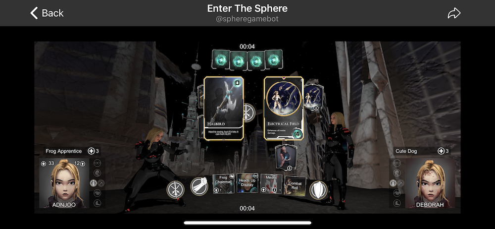

# enter-the-sphere-guide

> what is ETS?

ETS is a trading card game using the BCH blockchain, and Telegram for the game experience.

The main site can be found at [this link](https://enter-the-sphere.com/).

To play the game you can perform the following steps:

1. [Join the Telegram group chat](https://t.me/thespherechat)

2. Type
`/challenge @player_name 50`
where 50 is the minimum Orbs (in-game currency) needed to play another player, and @player_name is a Telegram user.

3. Wait for the other player to accept.

4. You will be taken into a screen like so:

4.a. Read the [Handbook link](https://enter-the-sphere.com/assets/EntertheSphereHandbook.pdf)

5. Play some cards, and use the attack button to try and defeat the other player.

..